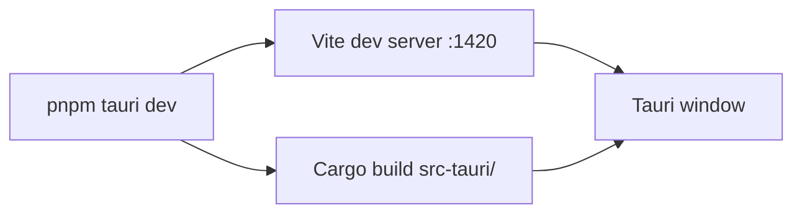

# Build_Config

**Özet:** Projenin derleme araç zinciri — Rust backend için Cargo, frontend için Vite + pnpm. Çapraz platform build'i Tauri CLI üzerinden yönetilir.

**Kütüphaneler:** pnpm, Vite 7, TypeScript 5.8, Cargo (Rust 2021 edition), Tauri CLI 2

**Bağlantılar:** [[Project_Overview]], [[Tauri_Backend]], [[React_Frontend]]

---

## Araç Zinciri

| Araç | Versiyon | Görev |
|---|---|---|
| Rust | 2021 edition | Backend derleme |
| pnpm | — | Frontend paket yönetimi |
| Vite | ^7.0.4 | Frontend dev server & build |
| TypeScript | ~5.8.3 | Frontend tip güvenliği |
| Tauri CLI | ^2 | Tauri build & dev |
| Tauri Build | 2 | Rust build script (build.rs) |

## Script'ler

```jsonc
// package.json
"dev": "vite",                         // Frontend dev server (port 1420)
"build": "tsc && vite build",          // Frontend production build
"preview": "vite preview",
"tauri": "tauri",                      // Tauri CLI wrapper
```

## Tauri Dev Workflow



## Önemli Yapılandırma

- **Vite**: `clearScreen: false` (Rust hatalarını gizleme), `strictPort: 1420`, HMR WS tunneling
- **pnpm**: `pnpm-workspace.yaml` → `esbuild` build'i onaylı
- **Cargo**: `crate-type = ["staticlib", "cdylib", "rlib"]` (çapraz platform için)
- **Tauri**: `beforeDevCommand: "pnpm dev"`, `devUrl: "localhost:1420"`

## Yeni Bağımlılık Ekleme Kuralı

```bash
# Frontend
pnpm add <paket>

# Backend (sadece cargo add — Cargo.toml elle düzenlenmez!)
cargo add <crate>
```
